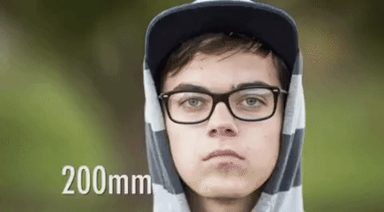

# MLFocalLengths

Modern camera lenses transmit the used focal length via the exif data which is then embedded in the raw images. However, when shooting with vintage lenses, this transfer of information is not taking place. Inferring the focallength of a photo soley from a monocular view requires knowledge about the scale of objects and their distance to the camera - e.g. scene understanding.

Animation taken from Reddit user [u/1Voice1Life](thttps://www.reddit.com/r/educationalgifs/comments/4a5ky3/how_different_lenses_affect_portraits/)

